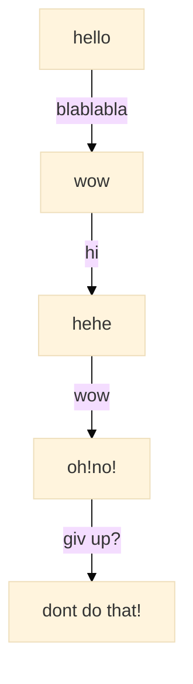

**try quote**

> “done?”

## **test1**

test numbering：

1. hi
2. hello
3. Apa Khabar


### **try html”**

<details> <summary> press button and see solution</summary>

```python
# ok i know i am genius
```

hi hope u always happy
</details>

try mermaid



done try

