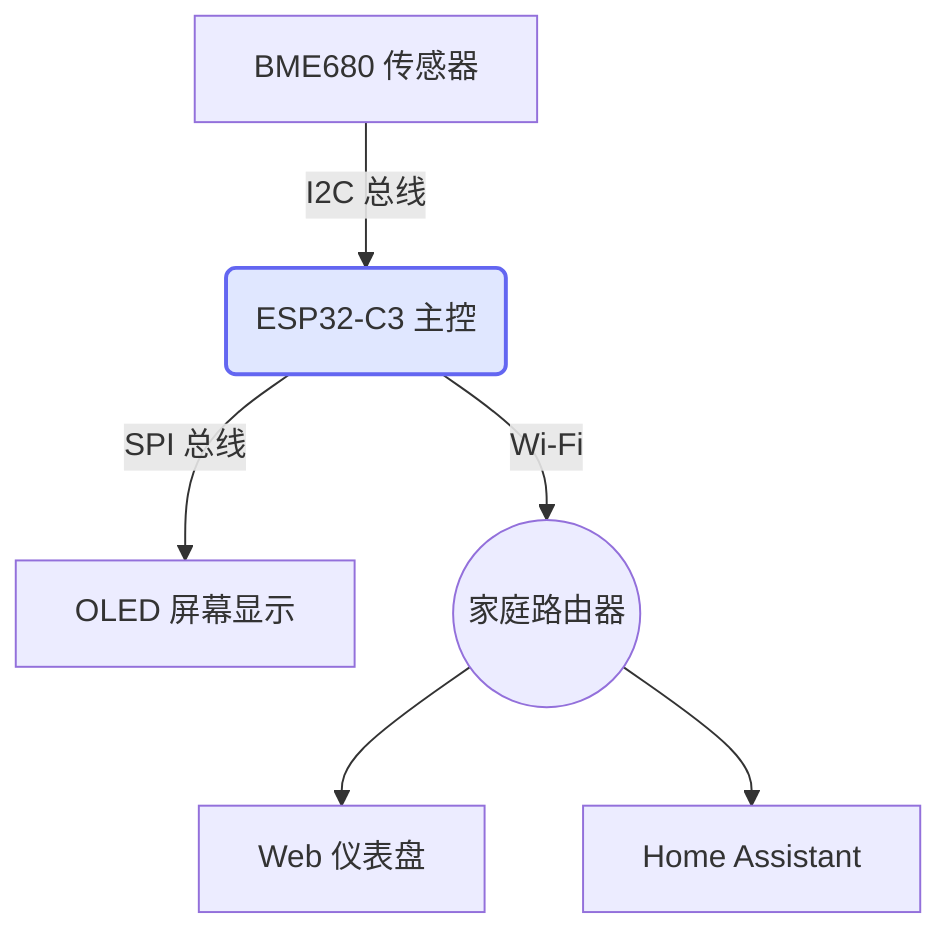

# testing1

abcd

## testing1.1

efgh

# 硬件与软件架构

try mermaid



## testing1.2

try formula

$$T_{comp} = T_{raw} \times \alpha + \beta \cdot \ln(R_{gas})$$

formula try done

<!-- tab: tab1 --> 

try coding

```python
print("Hello World")
```

<!-- tab: tab2-->

try tab2

```C++
print("Hello!")
```

genius!

<!-- tab: tab3 -->

i hope u like this template~